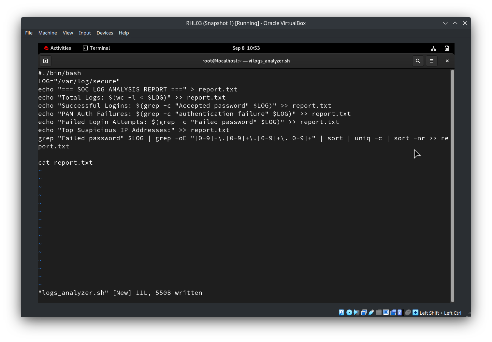
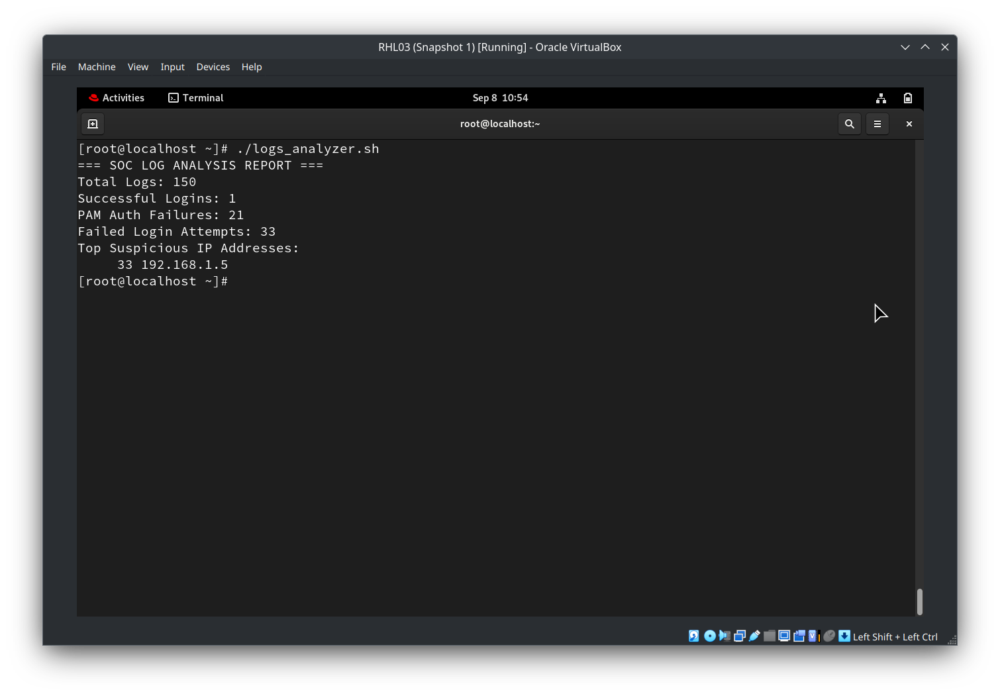

# SOC Log Analysis Tool

## 📌 Project Overview
This project simulates the day-to-day responsibilities of a Tier-1 Security Operations Center (SOC) Analyst by analyzing security logs in a Linux environment. The objective is to identify suspicious activities, investigate security events, and automate log analysis using Bash scripting. The project demonstrates how Linux command-line tools and shell scripting can be used to perform basic SOC log analysis and generate an automated security report.

## 🎯 Project Objectives
* Simulate SOC log analysis using Linux.
* Analyze security logs for suspicious events.
* Detect failed login attempts and PAM authentication failures.
* Identify suspicious IP addresses.
* Automate log analysis using a Bash script.
* Generate a security analysis report automatically.

## 🛠️ Technologies Used
* Linux Environment (RHEL / Kali Linux)
* Hydra (Brute-Force Attack Simulation)
* Bash Scripting
* Linux CLI Tools (`grep`, `wc`, `sort`, `uniq`)

## 📂 Project Files
* **`attack.log`** — Contains simulated security log entries (SSH brute-force attack).
* **`logs_analyzer.sh`** — Bash script that automates the log analysis.
* **`report.txt`** — Stores the automatically generated SOC analysis report after running the Bash script.
* **`README.md`** — Project documentation.

## ⚙️ Bash Script Features
A Bash script that automatically analyzes the log file and displays:
* Total number of log entries.
* Successful logins count.
* PAM authentication failures.
* Failed login attempts.
* Top suspicious IP addresses.

---

## 🔍 Lab Demonstration & Walkthrough

### 1. Attack Simulation (SSH Brute Force via Hydra)
An SSH brute-force attack was launched against the target host using `hydra` to generate realistic authentication failure entries and successful breach attempts in the system security logs:


### 2. The Bash Analysis Script (`logs_analyzer.sh`)
The script extracts critical metrics directly from `/var/log/secure` using regex and core Linux text utilities:



### 3. Execution & Automated Report Output
Running the script parses the attack traffic, identifies the attacker's IP, counts attempts, and outputs a formatted security report:



---

## 🚀 How to Run the Project

1. **Clone the repository:**
   ```bash
   git clone https://github.com/0xM4d/SSH-Brute-Force-Detection-SOC-Lab
   ```

2. **Go to the project directory:**
   ```bash
   cd SSH-Brute-Force-Detection-SOC-Lab
   ```

3. **Give execute permission:**
   ```bash
   chmod +x logs_analyzer.sh
   ```

4. **Run the script:**
   ```bash
   ./logs_analyzer.sh
   ```
   *The script parses the security log (`/var/log/secure` or local `attack.log`) and saves the results to `report.txt`.*

## 📄 Example Output (`report.txt`)
```text
=== SOC LOG ANALYSIS REPORT ===
Total Logs: 150
Successful Logins: 1
PAM Auth Failures: 21
Failed Login Attempts: 33
Top Suspicious IP Addresses:
     33 192.168.1.5
```

## 🧠 Skills Demonstrated
* Linux Administration
* Security Log Analysis
* Bash Scripting
* Incident Detection
* Linux Command-Line Proficiency

## 🚀 Future Enhancements
* Analyze larger log files.
* Generate CSV and PDF reports.
* Email alert notifications.
* Splunk SIEM integration.
* Real-time log monitoring.
